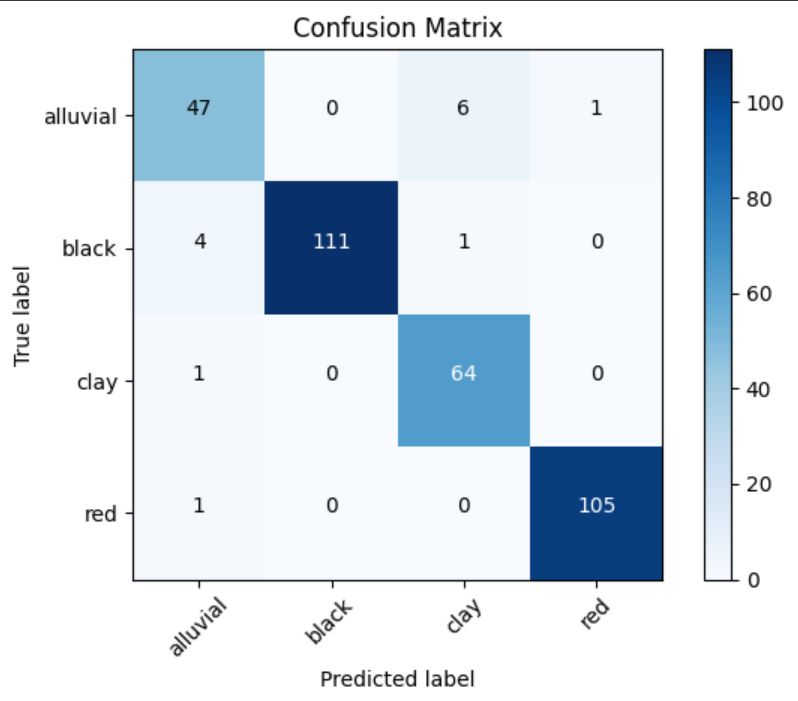

# MACHINE LEARNING TERRALYSIS
### A. Dataset and Model
- Dataset used: [dataset](https://www.kaggle.com/datasets/jayaprakashpondy/soil-image-dataset)
- Classifying soil types through scanned images / photos, there are 4 types of soil that are classified, namely:
  - Alluvial soil
  - Black soil
  - Clay soil
  - Red soil
- Create 2 types of models for training data:
  - Model 1, using base-simple CNN model
  - Model 2, using transfer learning with inceptionV3 --> Model fix
  - Model 3, using transfer learning with Xception
 ### B. Result
 - **ACCURACY & LOSS**
    - Model 1
  
      
      
    
    - Model 2
    
      
      
      
    - Model 3
 - **CONFUSION MATRIX**
    - Model 1
    
      
      
    - Model 2
    
      
      
    - Model 3
 - **CLASSIFICATION REPORT**
    - Model 1
    
      <table>
        <tr>
          <td></td>
          <th>Precision</th>
          <th>Recall</th>
          <th>f1-Score</th>
        </tr>
        <tr>
          <td>Macro Avg</td>
          <td>0.93</td>
          <td>0.92</td>
          <td>0.92/td>
        </tr>
        <tr>
          <td>Weighted Avg</td>
          <td>0.95</td>
          <td>0.94</td>
          <td>0.94</td>
        </tr>
      </table>

    - Model 2
    
    <table>
        <tr>
          <td></td>
          <th>Precision</th>
          <th>Recall</th>
          <th>f1-Score</th>
        </tr>
        <tr>
          <td>Macro Avg</td>
          <td>0.94</td>
          <td>0.95</td>
          <td>0.95/td>
        </tr>
        <tr>
          <td>Weighted Avg</td>
          <td>0.96</td>
          <td>0.96</td>
          <td>0.96</td>
        </tr>
      </table>
    
    - Model 3
    
    <table>
        <tr>
          <td></td>
          <th>Precision</th>
          <th>Recall</th>
          <th>f1-Score</th>
        </tr>
        <tr>
          <td>Macro Avg</td>
          <td>0.92</td>
          <td>0.94</td>
          <td>0.92/td>
        </tr>
        <tr>
          <td>Weighted Avg</td>
          <td>0.94</td>
          <td>0.93</td>
          <td>0.93</td>
        </tr>
      </table>
    
 - **CONCLUSION**
